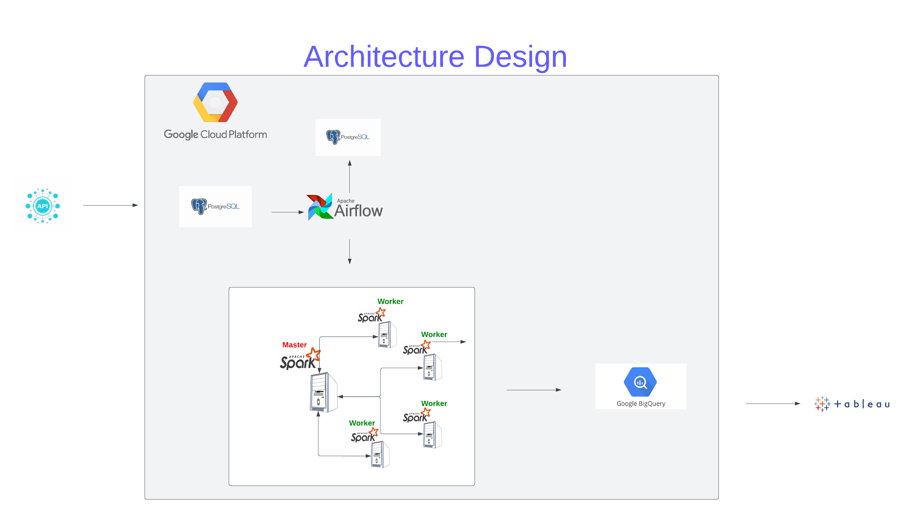

# Introduction

This repo contains the code to analyse and predict the crime data in LA city. The dataset is from a publicly available dataset

# Architecture

1. Data Ingestion and Storage: Data is ingested from the LA crime data API, updated weekly, and securely
   stored within a PostgreSQL database.
2. Job Scheduling: The project relies on Apache Airflow for efficient task scheduling to orchestrate various
   data processing activities.
   handling.
3. Data Analysis: The project harnesses Apache Spark for in-depth data analysis, with one master and four
   worker nodes to optimize performance.
4. Data Storage and Querying: Google BigQuery is the designated platform for data storage and retrieval.
5. Infrastructure: The project's infrastructure is hosted on the Google Cloud Platform (GCP).
   integrated with the dataset through the BigQuery connector.

# Repo Struture

This repo mainly contains dags in the `dags/` folder and experimental notebooks in `notebooks/` folder. All the ETL scripts are inside the `dags/etl_scripts/` folder. It uses docker compose to bring up containers. The specification of docker compose is in the `docker-compose.yml` file.

# Running the services

1. Run `docker compose build` to build custom images
2. Run `docker compose up` to start the services. This takes about 3 minutes to bring up all the services
3. Go to `localhost:8080` and use default airflow credentials to log in.
4. Enable `init_dag` DAG in the interface and wait for it to succeed. This creates the required table in staging database.
5. Enable `la_crime_dag` DAG to start ingesting the data

> Caveat: This repo uses service account for BigQuery. It would need the json file to be present in `spark/creds/` directory which it mounts inside all containers as `/creds/` directory.
